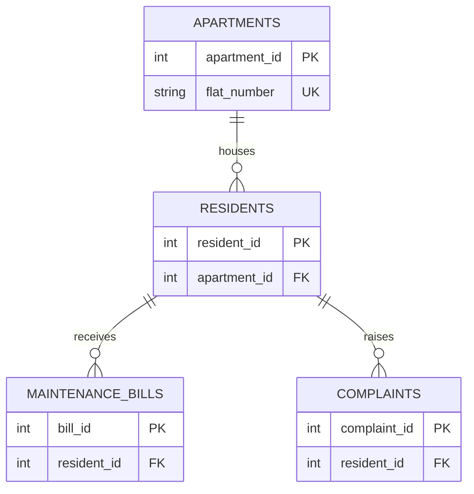

# ER Diagram

```mermaid
erDiagram
 APARTMENTS ||--o{ RESIDENTS : houses
 RESIDENTS ||--o{ MAINTENANCE_BILLS : receives
 RESIDENTS ||--o{ COMPLAINTS : raises
 APARTMENTS { int apartment_id PK string flat_number UK }
 RESIDENTS { int resident_id PK int apartment_id FK }
 MAINTENANCE_BILLS { int bill_id PK int resident_id FK }
 COMPLAINTS { int complaint_id PK int resident_id FK }
```
